# Using a scanner

To configure a scanner to work with the app, you need to set it up to send a
prefix and suffix. Both the prefix and suffix should be a single `¤` character.

## Zebra DS9308

To configure a Zebra DS9308 scanner, scan the following barcodes in order.

### Base configuration

> [!TIP]
> Tip! Use the trigger button while scanning these barcodes to go a bit faster.

Reset to factory defaults:

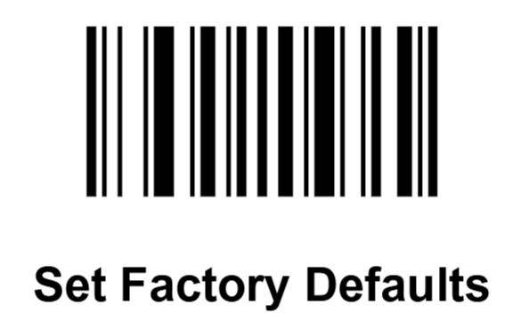

 
 

Set beep sound:

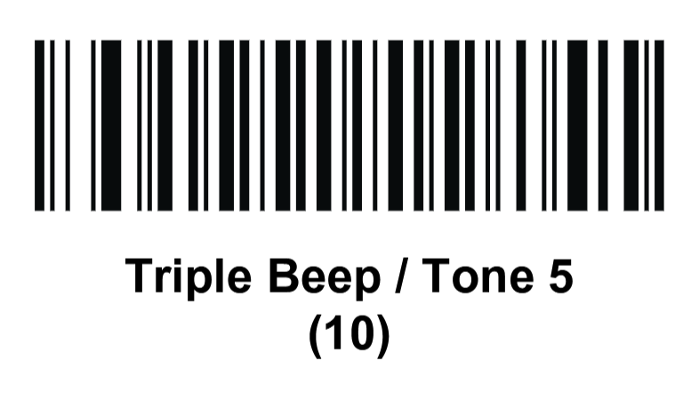

 
 

Enable presentation aiming pattern:

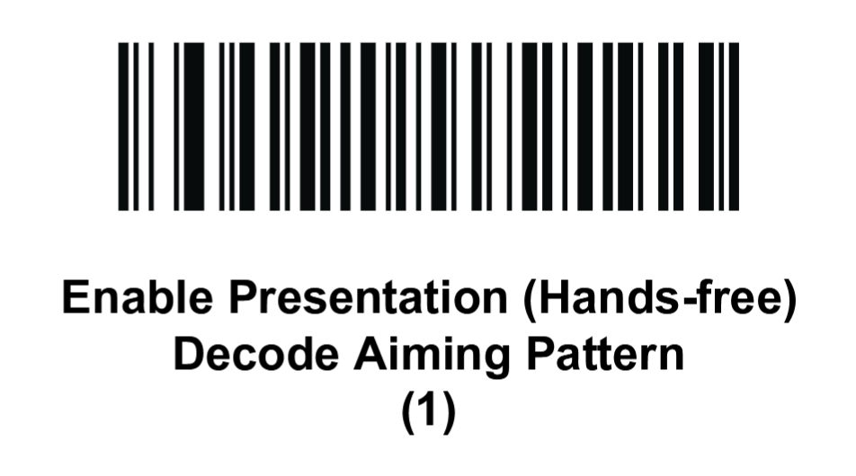

 
 

Enable enhanced mobile mode:

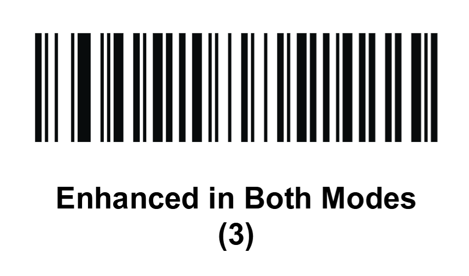

 
 

Lower the manual trigger timeout:

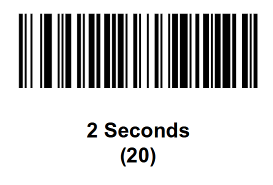

 
 

Suppress power up beeps:

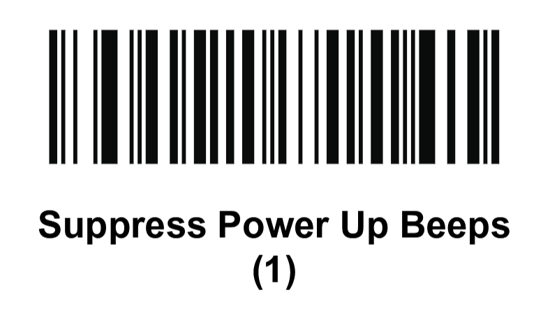

 
 

Set scan data format:

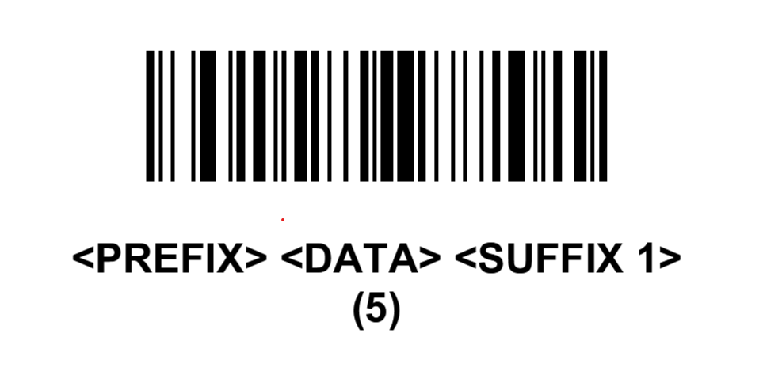

 
 

Set prefix:

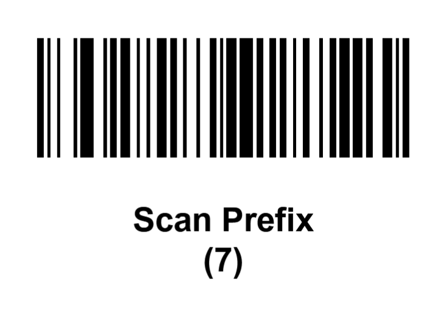

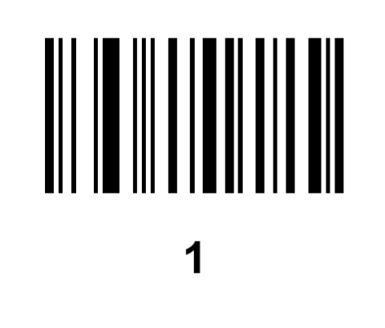

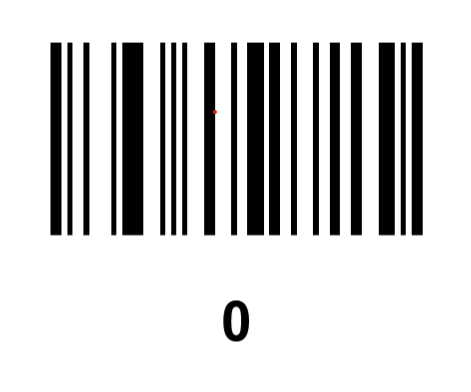

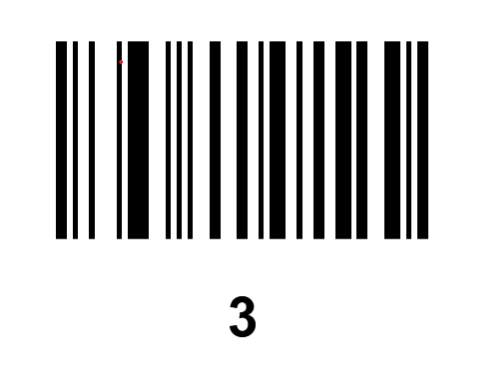

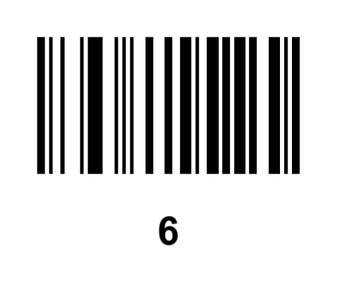

 
 

Set suffix:

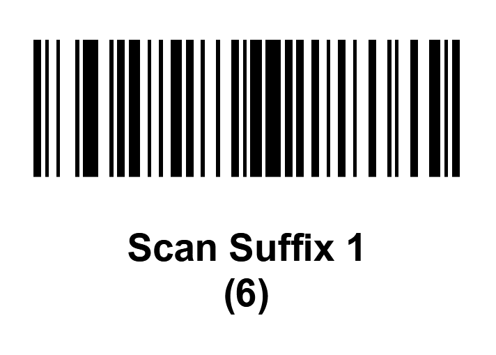

Disable configuration:

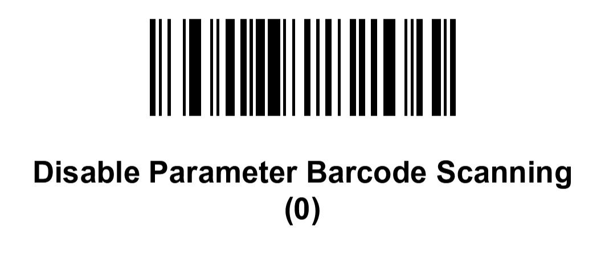

### Other useful settings

Volume:

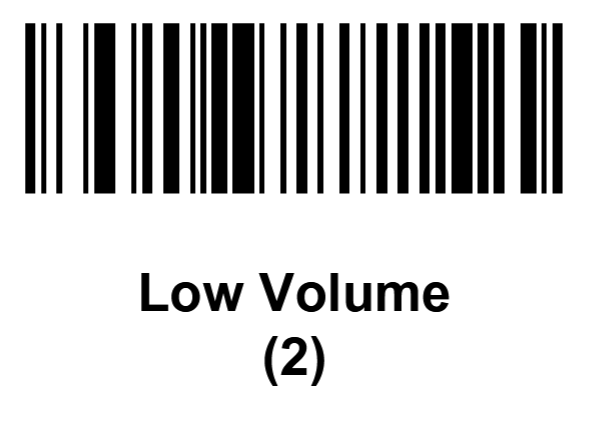

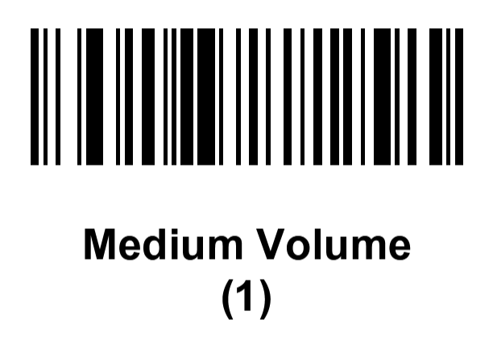

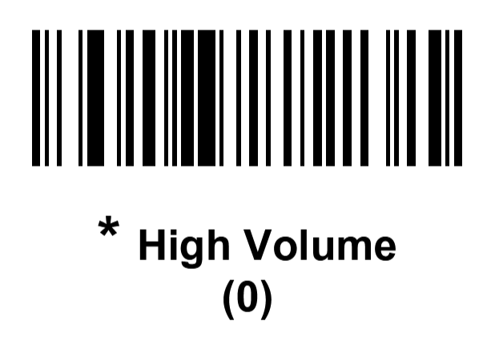

Enable/disable configuration:

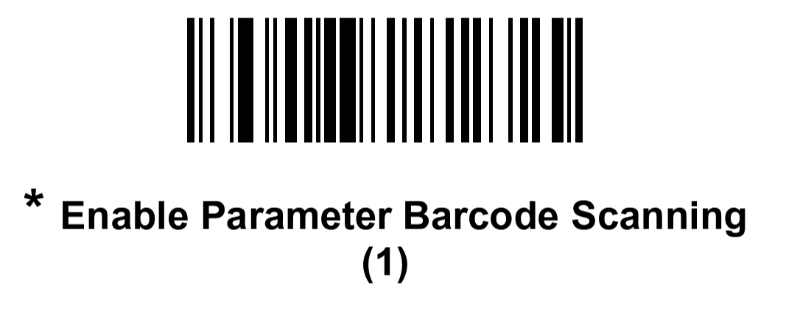

